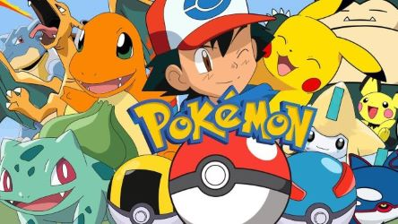
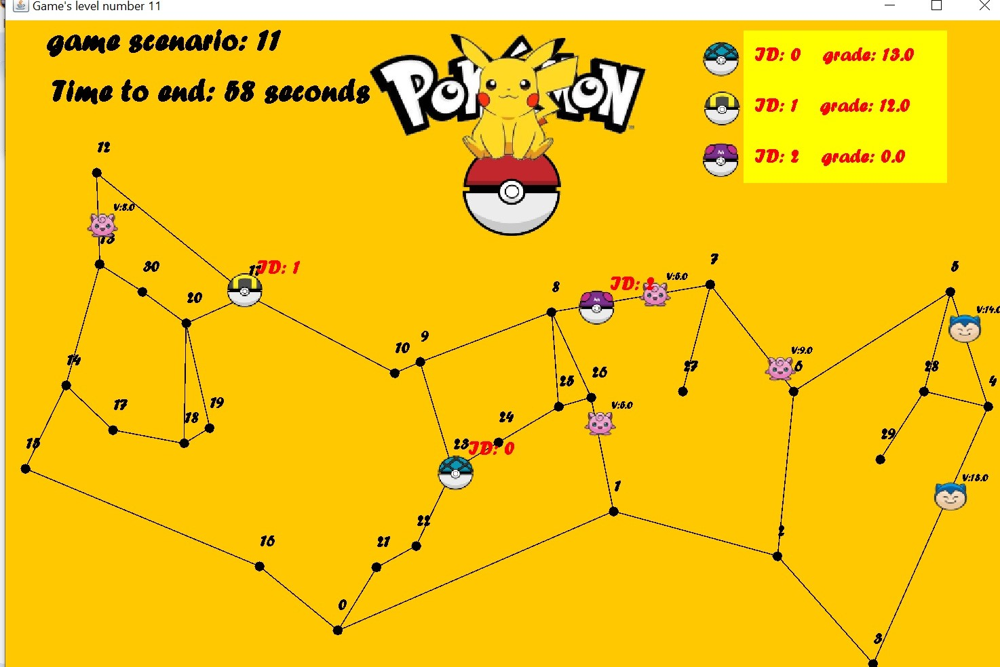
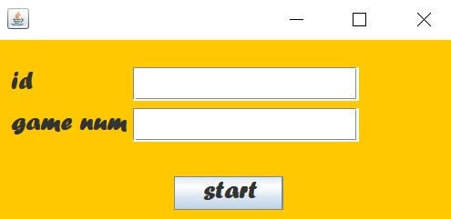

# The pokemon game 

## About the project:

On our project, we program a pokemon game, in which the game's arena is a directional weighted graph. 

## about the graph:

***description:***

The directional weighted graph is a data structure in which every edge has a direction and a weight (positive number).
This data structure contains vertexes from the type of node_data and edges from the type of edge_data, and each vertex has a collection containing all the edges which getting out of it.
For creating this data structure we program two new classes- DWGraph_DS  and DWGraph_Algo -every class implements an interface, which includes functions.

**DWGraph_DS:**

This class implements the functions of the interface called 'directed_weighted_graph'- functions on which applicable on an undirectional weighted graph, such as: 

- getNode(int node_id): returns the node_data from the graph by the node_id.

- getEdge(int src, int dest): returns the data of the edge 
(src-->dest), null if none.

- addNode(node_data n):  adds a new node to the graph with the given node_data.

- connect(int src, int dest, double w): connects an edge between src to dest with weight w.

- getV(): creates  another pointer for the collection which
representing all the nodes in the graph.
 
- getE(int node_id):   returns a collection containing all the 
edges which getting out of the given node_id.

- removeNode(int key): removes the node from the graph by its node_id, and removes all edges which start or end at this node.

- removeEdge(int src, int dest): deletes,the edge src-->dest from the graph.

- nodeSize(): finds the numbers of the nodes in the graph.

- edgeSize(): returns the number of the edges in the graph.

- getMC(): returns the number of the changes that have been made in the graph.

:pushpin: Must be specified- all the functions above runs in O(1), accept removeNode which run in O(k) {k- the number of the edges which start or end at the node}.

:pushpin: The classes NodeData and EdgeData, which respectively implement the 'node_data' and the 'edge_data' interfaces, are defined as internal public (static) classes in DWGraph_DS.

:pushpin: Attached herein two tests, one for DWGraph_DS and another for DWGraph_Algo. The tests examine the integrity of the functions that thhe classes
support,on both basic and extreme cases.

:on: *For using those tests you need to have the version of JUnit5*

**DWGraph_Algo:**

This class implements the algorithms of the interface called 'dw_graph_algorithms'- algorithms which applicable on an undirectional weighted graph, such as: 

- init(graph): init the graph on which this set of algorithms operates on.

- copy(): creating another graph by deep copy.

- isConnected(): checking of the graph is a strongly connected component- uses BFS algorithm.

- double shortestPathDist(int src, int dest): returns the smallest distance between src(node_id) and dest(node_id). uses Dijkstra's algorithm.

- List<node_data> shortestPath(int src, int dest): returns the shortest path with the lowest distance between src and dest , uses Dijkstra's algorithm.

- save(String file):  saves this weighted directed graph to a given file name - in JSON format.

- load( String file): load a graph to this graph algorithm.

## About the pokemon game: 
### Description:
The pokemon game is a game in which there are pokemon, that scattered randomly on the graph, and agents who need to catch the pokemons in a limited time.
**The target of the game** 
is to catch as many pokemons as possible with up to 10 moves(game.move() function) for a second by the agents before the time of the game is over.

:chart_with_upwards_trend: **why using this game?**
on our project we program a good-performing algorithm which move the agents on the graph in a way of getting high grade with the demand of up to ten server's move.

Our game's scenarios results:

 

***How to play the game?***
There are two option for playing the game:

:white_check_mark: by using the **Command Prompt**, with the commad: java -jar Ex2.jar (your id) (the game's scenario number)

:white_check_mark: by **clicking here directly on the Ex2.jar** : (*****) and input your id and the game's scenario number at the current fields and than press 'start':

:heavy_exclamation_mark: At this repotisity attached 24 game's scenarios with the numbers of [0,23] for your choice, 
if the willing to add more game's scenario you can creates a JSON string of your own with the following pattern, and save this file on data's folder: (https://github.com/ShiraAnaki130/OOP_ex2/blob/master/data/A0)

:heavy_exclamation_mark: The arena of those given game's scenarios is a connected directional weighted graph, but the game's program fits to diconnected graph arena as well.

:link: **In order to use the project's codes** you need to write the following commend on you Command Prompt: 

(you new folder’s address) git clone  https://github.com/ShiraAnaki130/OOP_ex2.git.

:lock: Please don't make any change on the codes without our permission.

Good luck!

:copyright: Lea Zuckerman and Shira Anaki.
